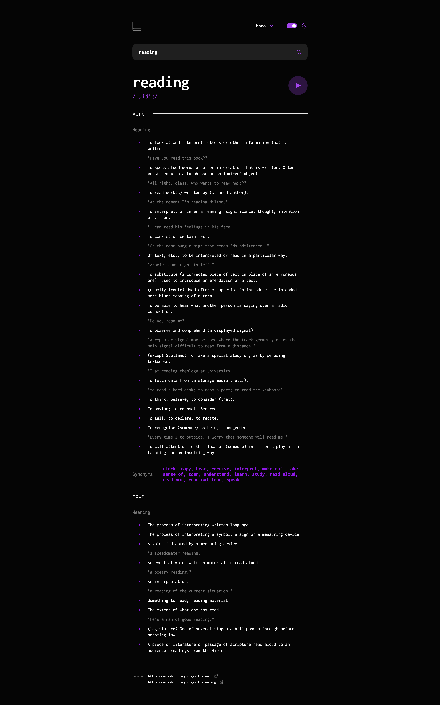

# Frontend Mentor - Dictionary web app solution

This is a solution to the [Dictionary web app challenge on Frontend Mentor](https://www.frontendmentor.io/challenges/dictionary-web-app-h5wwnyuKFL). Frontend Mentor challenges help you improve your coding skills by building realistic projects.

## Table of contents

- [Overview](#overview)
  - [The challenge](#the-challenge)
  - [Screenshot](#screenshot)
  - [Links](#links)
- [My process](#my-process)
  - [Built with](#built-with)
  - [What I learned](#what-i-learned)
  - [Continued development](#continued-development)
  - [Useful resources](#useful-resources)
- [Author](#author)

## Overview

### The challenge

Users should be able to:

- Search for words using the input field
- See the Free Dictionary API's response for the searched word
- See a form validation message when trying to submit a blank form
- Play the audio file for a word when it's available
- Switch between serif, sans serif, and monospace fonts
- Switch between light and dark themes
- View the optimal layout for the interface depending on their device's screen size
- See hover and focus states for all interactive elements on the page
- **Bonus**: Have the correct color scheme chosen for them based on their computer preferences. _Hint_: Research `prefers-color-scheme` in CSS.

### Screenshot




### Links

- Solution URL: [GitHub Repository](https://github.com/GFJankavs/vue-dictionery-web-app)
- Live Site URL: [Website](https://gfjankavs.github.io/vue-dictionary-web-app/)

## My process

### Built with

- CSS custom properties
- Flexbox
- CSS Grid
- Mobile-first workflow
- [Vue](https://vuejs.org/) - Progressive JS Framework
- [Pinia](https://pinia.vuejs.org/) - Store for Vue.js

### What I learned

Use this section to recap over some of your major learnings while working through this project. Writing these out and providing code samples of areas you want to highlight is a great way to reinforce your own knowledge.

To see how you can add code snippets, see below:

I had previously worked with **VueJS** but with version 2, not 3. As I am a Frontend developer who mostly works with React, this was an interesting learning experience once more with a different JS framework that I don't use often.

While developing this project, this was my first time using state management library in VueJS - **Pinia**. Suprisingly, it was easier to pick up than I had initially anticipated.

Additionally, I had not previously incorporated usage of `prefers-color-scheme` in any of my prior projects.

What was quite pleasant while working on this project was not using libraries like `styled-components` to add dynamic styling for components as it can be done in Vue without it.

### Continued development

In future projects, I would like to make some more projects using Vue and also Angular to become more familiar with distinguishments between all 3 major frameworks. Possibly could also make one using Svelte.

### Useful resources

- [Pinia](https://pinia.vuejs.org/) - Documentation for state management library in Vue.js. It is pretty straight forward as well easy to comprehend to get started.
- [Stackoverflow - Dark mode in JS](https://stackoverflow.com/questions/56393880/how-do-i-detect-dark-mode-using-javascript) - This page has a good answer from a user in how to detect if the browser has dark mode enabled or not. Additionally, there is a way how to detect not only initial state, but also subscribe to changes if you want to run code in such situations.
- [Deploy Vue App to GitHub pages](https://learnvue.co/articles/deploy-vue-to-github-pages) - Nice and straight-to-point article about how to publish your Vue project in Github Pages. **Note** - in this article it is mentioned to use `publicDir` for setting public path for the project based on environment. If you are building Vue project using Vite, then you should use `base` key, instead of `publicDir`

```typescript
export default defineConfig({
  ...some other settings,
  base: process.env.NODE_ENV === "production" ? "/REPO_NAME/" : "/",
})
```

## Author

- Website - [G.F.Jankavs](https://www.gfjankavs.lv/)
- Frontend Mentor - [@GFJankavs](https://www.frontendmentor.io/profile/GFJankavs)
- LinkedIn - [Gustavs Fricis Jankavs](https://www.linkedin.com/in/gustavs-fricis-jankavs/)
- DEV - [@gfjankavs](https://dev.to/gfjankavs)
